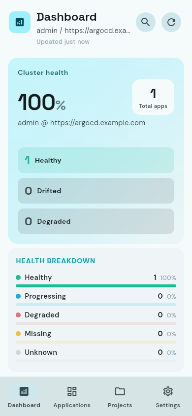
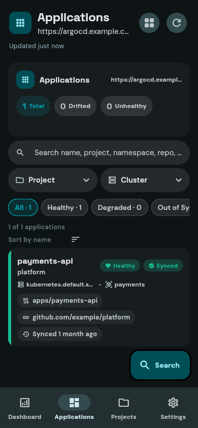
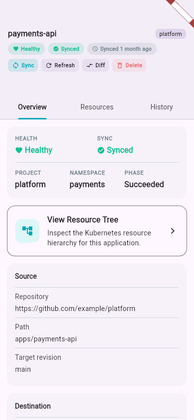

# ArgoCD Flutter

  

Flutter app shell for ArgoCD operators, based on the local development setup
and GitHub Actions shape used in `../happy_flutter`.

## Screenshots

## Setup

1. Install `devenv`: `curl -fsSL https://devenv.sh | bash`
2. Enter the shell: `devenv shell`
3. Fetch packages: `devenv shell -- flutter pub get`
4. Run locally: `devenv shell -- flutter run`

## Quality Checks

- Analyze: `devenv shell -- flutter analyze`
- Test: `devenv shell -- flutter test`
- Build Android debug APK: `devenv shell -- flutter build apk --debug`
- Build web bundle: `devenv shell -- flutter build web --release`

## CI

The repository includes:

- `devenv.nix` aligned with `../happy_flutter`
- GitHub Actions for analysis, tests, APK builds, and web builds
